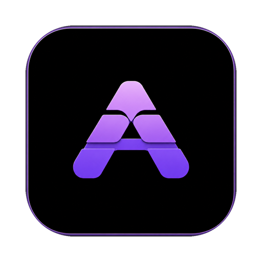

<p align="center">
  
</p>

# AndSpace

AndSpace is a terminal-first macOS app for local development. It keeps the
terminal as the center of work, then adds lightweight helpers for project
context, command safety, local AI CLI handoff, server discovery, and read-only
Git inspection.

- Website: https://andspace.app
- Current alpha: `v0.1.0-alpha.2`
- Download: https://github.com/SetFodi/Andspace/releases/tag/v0.1.0-alpha.2

## What Is Included

- Terminal tabs and split panes
- Pane focus navigation with `Cmd+Arrow`
- Workspace restore for tabs, splits, cwd, sidebar state, and window shape
- Command Guard with project rules from `ANDSPACE.md`
- AI CLI handoff to installed local Claude Code, Codex, and Cursor CLIs
- Command palette and keyboard shortcuts overlay
- Optional project sidebar with Files, Scripts, Servers, and Git Changes
- File Actions for Cursor, VS Code, Neovim split, copy path, and Finder reveal
- Passive localhost server detection from terminal output
- Read-only Git Changes
- Read-only Git Diff Preview

AndSpace does not call provider APIs, manage API keys, or create API billing.
AI handoff is local CLI orchestration only.

## Screenshots

Screenshots for the public alpha are tracked in
[docs/screenshots/README.md](docs/screenshots/README.md). The checklist covers:

- Main terminal with sidebar
- Command Guard
- AI handoff
- Command palette
- Git Diff Preview
- Servers
- Keyboard shortcuts

## Install The Alpha

1. Download the macOS ZIP from the
   [v0.1.0-alpha.2 GitHub release](https://github.com/SetFodi/Andspace/releases/tag/v0.1.0-alpha.2).
2. Unzip it.
3. Move `AndSpace.app` to `/Applications` if desired.
4. Launch AndSpace.

This prerelease alpha is not notarized yet. macOS may block the first launch;
use right-click -> Open from Finder, or allow the app in Privacy & Security.

SHA-256 for the release ZIP:

```text
e6d2c7fe0357e2e9e04fcf3ef9128dd6e8dd57b6bf0c43dac8e9cac4907d5526
```

## Alpha Limitations

- macOS-first, currently packaged for Apple Silicon
- zsh-first shell integration
- Prerelease alpha; expect rough edges
- Not signed with a Developer ID
- Not notarized
- No auto-update
- Local AI CLI handoff only
- No provider API billing or hosted AI backend
- No Git write actions: no staging, commit, push, pull, reset, checkout, stash,
  merge, or rebase UI
- No embedded browser preview
- No built-in editor

## Shortcuts

| Shortcut | Action |
| --- | --- |
| `Cmd+T` | New tab |
| `Cmd+W` | Close active pane / tab |
| `Cmd+O` | Split right |
| `Cmd+L` | Split down |
| `Cmd+Arrow` | Move focus between panes |
| `Cmd+Left` | From the leftmost pane, focus the sidebar |
| `Cmd+Right` | From the sidebar, return to the terminal |
| `Cmd+B` | Toggle sidebar |
| `Cmd+0` | Focus sidebar |
| `Cmd+K` | Command palette |
| `Cmd+E` | AI handoff |
| `Cmd+/` | Keyboard shortcuts |
| `Cmd+Shift+I` | Create `ANDSPACE.md` |
| `Cmd+[` / `Cmd+]` | Previous / next tab |
| `Cmd+1`-`Cmd+9` | Jump to tab |

## Development Setup

```bash
pnpm install
pnpm build
pnpm tauri dev
```

The first `pnpm tauri dev` run compiles Cargo dependencies. Later runs are
incremental. `pnpm build` populates `dist/`, which Tauri validates at compile
time.

## Build Locally

```bash
pnpm tauri build
```

The packaged macOS app is written to:

```text
src-tauri/target/release/bundle/macos/AndSpace.app
```

## Documentation

- [v0.1 status](docs/V0_1.md)
- [release checklist](docs/V0_1_RELEASE_CHECKLIST.md)
- [dogfood checklist](docs/DOGFOOD_CHECKLIST.md)
- [workspace persistence](docs/WORKSPACE_PERSISTENCE.md)
- [Command Guard](docs/COMMAND_GUARD.md)
- [AI handoff](docs/AI_HANDOFF.md)
- [Command Palette](docs/COMMAND_PALETTE.md)
- [Project Sidebar](docs/PROJECT_SIDEBAR.md)
- [Servers](docs/SERVERS.md)
- [Git Changes](docs/GIT_CHANGES.md)
- [File Actions](docs/FILE_ACTIONS.md)
