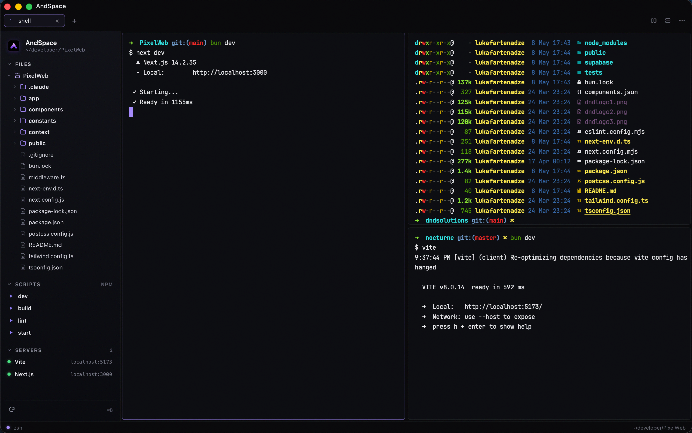
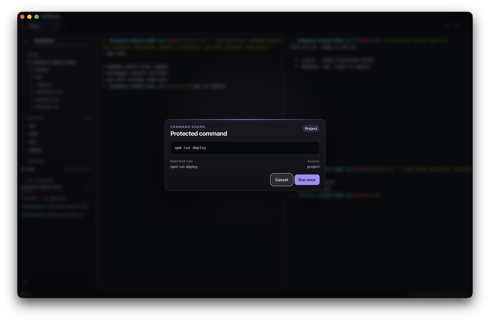
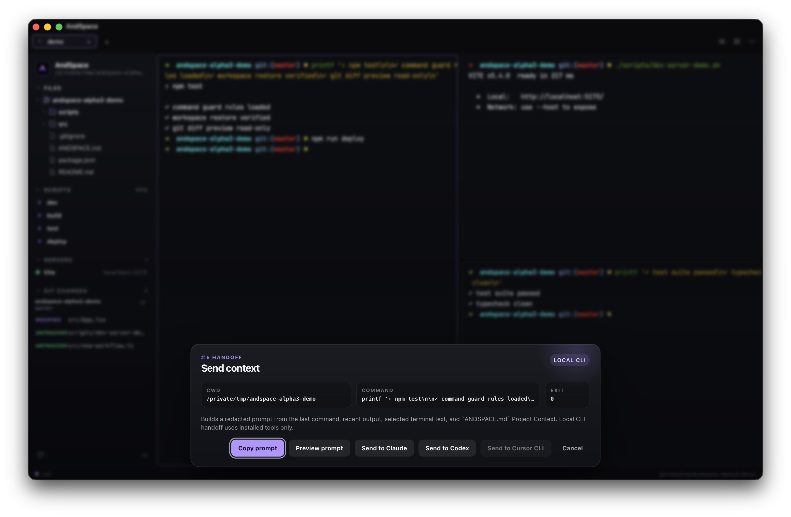
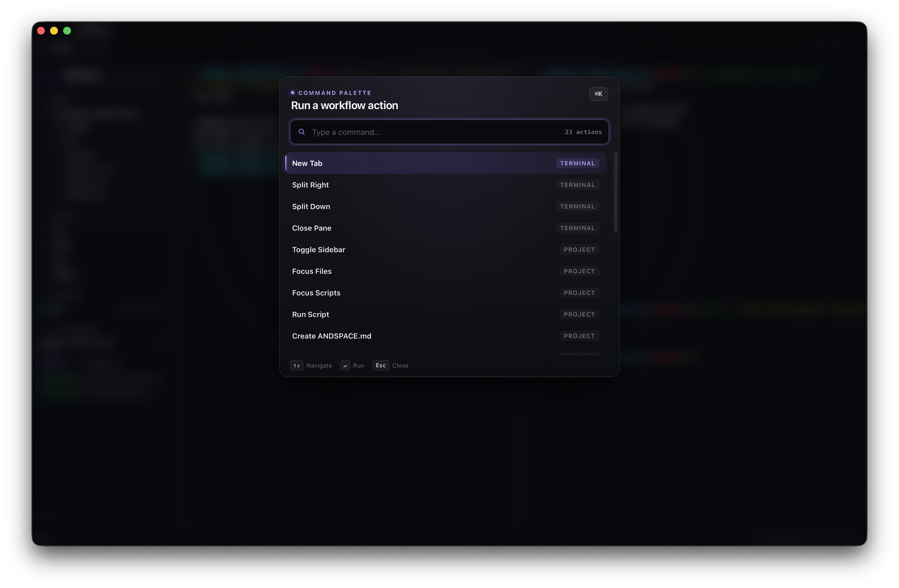
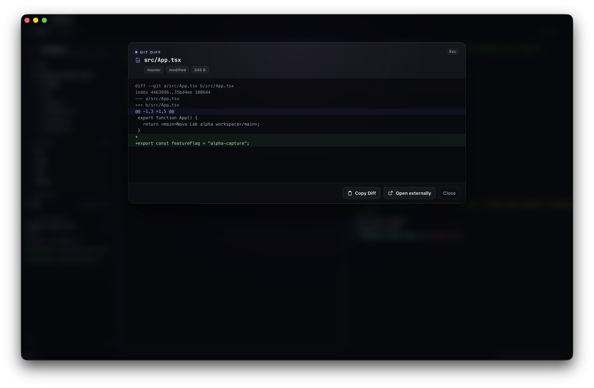
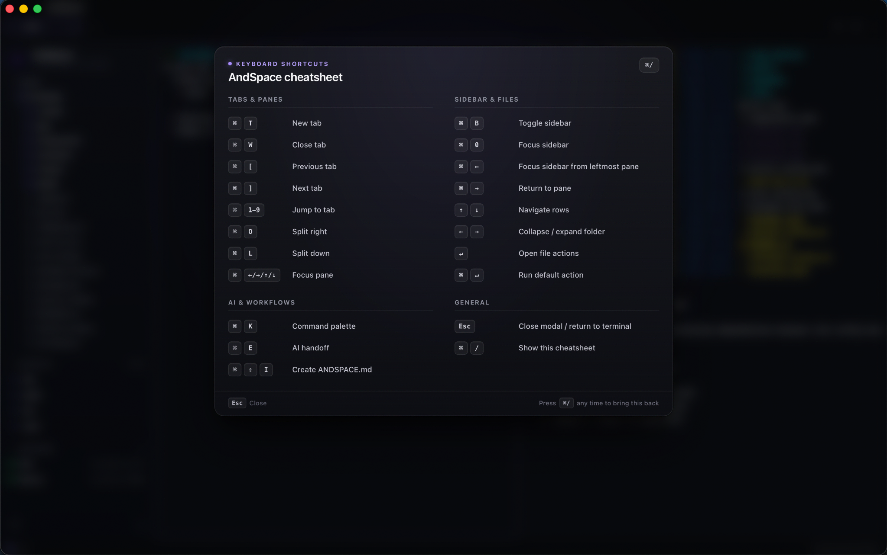

<p align="center">
  
</p>

# AndSpace

AndSpace is a terminal-first macOS app for local development. It keeps the
terminal as the center of work, then adds lightweight helpers for project
context, command safety, local AI CLI handoff, server discovery, and read-only
Git inspection.

- Website: https://andspace.app
- Current alpha: `v0.1.0-alpha.7`
- Download: https://github.com/SetFodi/Andspace/releases/tag/v0.1.0-alpha.7
- Demo: https://andspace.app/andspace.mp4
- Privacy: https://andspace.app/privacy
- Security: https://andspace.app/security
- Feedback: https://github.com/SetFodi/Andspace/issues

## What Is Included

- Terminal tabs and split panes
- Pane focus navigation with `Cmd+Arrow`
- Workspace restore for tabs, splits, cwd, sidebar state, and window shape
- First-run onboarding and lightweight local preferences
- Command Guard with project rules from `ANDSPACE.md`
- AI CLI handoff to installed local Claude Code, Codex, and Cursor CLIs
- Command palette and keyboard shortcuts overlay
- Optional project sidebar with Files, Scripts, Servers, and Git Changes
- File Actions for Cursor, VS Code, Neovim split, copy path, and Finder reveal
- Passive localhost server detection from terminal output
- Right-side Local Preview for detected localhost/private-LAN dev servers
- Read-only Git Changes
- Read-only Git Diff Preview

AndSpace does not call provider APIs, manage API keys, or create API billing.
AI handoff is local CLI orchestration only.

## Watch Demo

Watch the short alpha demo:
[andspace.app/andspace.mp4](https://andspace.app/andspace.mp4)

## Screenshots

Real product screenshots live in `docs/screenshots/final/`. The full capture
checklist is tracked in [docs/screenshots/README.md](docs/screenshots/README.md).














## Install The Alpha

1. Download the macOS ZIP or DMG from the
   [v0.1.0-alpha.7 GitHub release](https://github.com/SetFodi/Andspace/releases/tag/v0.1.0-alpha.7).
2. For a ZIP, unzip it. For a DMG, open it and drag `AndSpace.app` to
   Applications.
3. Move `AndSpace.app` to `/Applications` if you downloaded the ZIP.
4. Launch AndSpace.

AndSpace is currently an unsigned prerelease alpha. macOS may require
right-click -> Open, or approval from System Settings -> Privacy & Security
after the first blocked launch attempt.

SHA-256 checksums from the latest local packaging run:

```text
2a76eb64f3e56702c22a382c692cb7a59f6c30d4d32cdcb32c2352295fa6bb4e  AndSpace-v0.1.0-alpha.7-macos.zip
f3a05ea81c67a5961f8e2f4f29774468e5a7bb4035f34e2f2bf2528cd32e9d2c  AndSpace_0.1.0-alpha.7_aarch64.dmg
```

For verification steps and install-warning context, see
[docs/VERIFY_DOWNLOAD.md](docs/VERIFY_DOWNLOAD.md). The GitHub release also
includes the checksum file generated for the public artifacts.

Local release packaging and checksum generation:

```bash
scripts/package-alpha.sh
```

## Alpha Limitations

- macOS-first, currently packaged for Apple Silicon
- zsh-first shell integration
- Prerelease alpha; expect rough edges
- Unsigned prerelease alpha; macOS may show a first-launch warning
- No auto-update
- Local AI CLI handoff only
- No provider API billing or hosted AI backend
- No Git write actions: no staging, commit, push, pull, reset, checkout, stash,
  merge, or rebase UI
- Local preview is limited to detected localhost/private-LAN dev URLs only
- No built-in editor

## Privacy And Security

- [Privacy notes](docs/PRIVACY.md): local app behavior, local AI CLI handoff,
  workspace persistence, diagnostics, and website logs.
- [Security notes](docs/SECURITY_NOTES.md): unsigned alpha install context,
  Command Guard limits, read-only Git behavior, and reporting guidance.
- [Verify downloads](docs/VERIFY_DOWNLOAD.md): SHA-256 checksum commands for
  the ZIP and DMG.
- [Known issues](docs/KNOWN_ISSUES.md): current alpha limits and what is worth
  reporting.
- [Homebrew cask draft](docs/HOMEBREW_CASK.md): planned install path after
  alpha artifacts stabilize.

Use `Cmd+K` -> **Copy Diagnostics** when reporting bugs. The copied block is
sanitized: it includes version, macOS/architecture, renderer, shell status,
active cwd, and local support paths, but no terminal output, command history,
AI prompts, secrets, Git diffs, or environment variable values.

## Performance Note

AndSpace is built on Tauri, WKWebView, and xterm.js. Recent alpha hardening
adds bounded PTY backpressure, larger PTY read chunks, compact PTY transport,
and lower retained scrollback. It performs well for normal local development,
but it is not positioned as a raw-throughput replacement for native GPU
terminals like Ghostty.

## Shortcuts

| Shortcut | Action |
| --- | --- |
| `Cmd+T` | New tab |
| `Cmd+W` | Close active pane / tab |
| `Cmd+O` | Split right |
| `Cmd+L` | Split down |
| `Cmd+Arrow` | Move focus between panes |
| `Cmd+Left` | From the leftmost pane, focus the sidebar |
| `Cmd+Right` | From the sidebar, return to the terminal |
| `Cmd+B` | Toggle sidebar |
| `Cmd+0` | Focus sidebar |
| `Cmd+K` | Command palette |
| `Cmd+,` | Preferences |
| `Cmd+P` | Color scheme picker |
| `Cmd+E` | AI handoff |
| `Cmd+/` | Keyboard shortcuts |
| `Cmd+Shift+I` | Create `ANDSPACE.md` |
| `Cmd+[` / `Cmd+]` | Previous / next tab |
| `Cmd+1`-`Cmd+9` | Jump to tab |

## Development Setup

```bash
pnpm install
pnpm build
pnpm tauri dev
```

The first `pnpm tauri dev` run compiles Cargo dependencies. Later runs are
incremental. `pnpm build` populates `dist/`, which Tauri validates at compile
time.

## Build Locally

```bash
pnpm tauri build
```

The packaged macOS app is written to:

```text
src-tauri/target/release/bundle/macos/AndSpace.app
src-tauri/target/release/bundle/dmg/
```

## Documentation

- [v0.1 status](docs/V0_1.md)
- [release checklist](docs/V0_1_RELEASE_CHECKLIST.md)
- [dogfood checklist](docs/DOGFOOD_CHECKLIST.md)
- [macOS signing and notarization](docs/MACOS_SIGNING_NOTARIZATION.md)
- [privacy notes](docs/PRIVACY.md)
- [security notes](docs/SECURITY_NOTES.md)
- [verify downloads](docs/VERIFY_DOWNLOAD.md)
- [known issues](docs/KNOWN_ISSUES.md)
- [Homebrew cask preparation](docs/HOMEBREW_CASK.md)
- [preferences](docs/PREFERENCES.md)
- [local preview](docs/LOCAL_PREVIEW.md)
- [terminal comparison benchmark](docs/TERMINAL_COMPARISON_BENCHMARK.md)
- [workspace persistence](docs/WORKSPACE_PERSISTENCE.md)
- [Command Guard](docs/COMMAND_GUARD.md)
- [AI handoff](docs/AI_HANDOFF.md)
- [Command Palette](docs/COMMAND_PALETTE.md)
- [Project Sidebar](docs/PROJECT_SIDEBAR.md)
- [Servers](docs/SERVERS.md)
- [Git Changes](docs/GIT_CHANGES.md)
- [File Actions](docs/FILE_ACTIONS.md)
